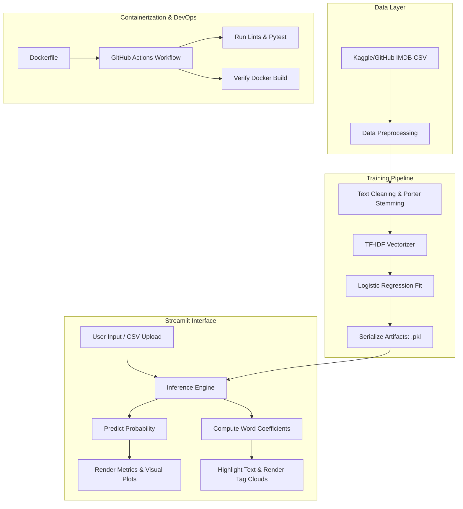

# 🔮 SentimentLens: Advanced Sentiment Analytics & Explanation Engine

[](https://github.com/yourusername/sentiment-lens-app/actions)
[](https://hub.docker.com/r/yourusername/sentiment-lens-app)
[](https://streamlit.io/)

**SentimentLens** is a production-ready, resume-grade Natural Language Processing (NLP) web application built to classify movie review sentiments (Positive/Negative) and provide explainable predictions in real-time. 

Instead of treating the machine learning model as a "black box," SentimentLens implements a local mathematical feature attribution method. It maps TF-IDF coefficients directly back to the source text, highlighting exactly which words triggered a positive (emerald green) or negative (ruby red) classification.

---

## 🚀 Key Features

*   **🔍 Interactive Analysis Hub**:
    *   Single-review prediction with real-time probability confidence.
    *   **LIME-Style Local Attribution**: Visually highlights positive/negative words in the review based on mathematical feature importances (TF-IDF weights × coefficients).
    *   Readability and text statistics (word count, reading time estimates).
*   **📊 Batch Processor**:
    *   Bulk upload of CSV files containing customer reviews.
    *   Interactive data analytics using **Plotly** (donut charts of sentiment distribution, word count histograms by sentiment class).
    *   Dynamic HTML/CSS tag clouds (word clouds) representing positive and negative vocabularies in the uploaded dataset.
    *   Downloadable result files with predicted labels and confidence scores.
*   **⚙️ Engine Diagnostics & Retraining**:
    *   Interactive **Confusion Matrix** heatmap.
    *   **Vocabulary Coefficient Explorer**: Searchable dictionary containing all model terms and their exact positive/negative weights.
    *   **On-Demand Local Retraining**: Slide to select dataset size and trigger live retraining, reloading the model state dynamically.
*   **🐳 Production Containerization**: A fully optimized Docker image pre-trained with 10k+ IMDB samples for instant startup.
*   **🛡️ CI/CD Integration**: Automatically tests codebase formatting (`flake8`), executes unit tests (`pytest`), and checks Docker builds on every GitHub push.

---

## 🛠️ Technology Stack

*   **Frontend & UI**: Streamlit, HTML5, Custom CSS
*   **Machine Learning**: Scikit-Learn (TfidfVectorizer, LogisticRegression), NumPy, Joblib
*   **Data Processing**: Pandas, NLTK (Tokenization, Stopwords, Porter Stemming)
*   **Data Visualization**: Plotly Express
*   **Testing & Quality**: PyTest, Flake8
*   **DevOps & Containerization**: Docker, GitHub Actions (YAML Workflows)

---

## 📐 Architecture & Workflow



---

## 📖 Mathematical Explanation of the Attribution Model

SentimentLens uses a **TF-IDF + Logistic Regression** model. The prediction for a document $d$ is determined by the log-odds:

$$\text{log-odds} = \beta_0 + \sum_{i \in \text{vocab}} \beta_i \cdot \text{TF-IDF}(w_i, d)$$

Where:
*   $\beta_0$ is the model intercept.
*   $\beta_i$ is the coefficient weight of word $w_i$.
*   $\text{TF-IDF}(w_i, d)$ is the TF-IDF weight of word $w_i$ in document $d$.

To explain the prediction for a single review, we compute the individual attribution score $S$ for each word in the input text:

$$S(w_i, d) = \beta_i \cdot \text{TF-IDF}(w_i, d)$$

*   If $S(w_i, d) > 0.001$, the word is highlighted as a **Positive Contributor** (Emerald Green).
*   If $S(w_i, d) < -0.001$, the word is highlighted as a **Negative Contributor** (Ruby Red).
*   Otherwise, the word remains neutral.

This provides local explanation scores that are mathematically exact to the model's inner decision logic.

---

## 🏃 Local Setup & Installation

### Prerequisites
*   Python 3.11+
*   Git

### Step-by-Step Installation

1.  **Clone the Repository**:
    ```bash
    git clone https://github.com/yourusername/sentiment-lens-app.git
    cd sentiment-lens-app
    ```

2.  **Create a Virtual Environment**:
    ```bash
    python -m venv venv
    # On Windows:
    .\venv\Scripts\activate
    # On macOS/Linux:
    source venv/bin/activate
    ```

3.  **Install Dependencies**:
    ```bash
    pip install -r requirements.txt
    ```

4.  **Run the Training Pipeline**:
    Generate the default classification model using IMDB movie reviews:
    ```bash
    python -m src.train
    ```

5.  **Run Streamlit**:
    Launch the web application locally:
    ```bash
    streamlit run app.py
    ```
    Access the app in your browser at `http://localhost:8501`.

---

## 🐳 Docker Deployment

To build and run the containerized application:

1.  **Build the Docker Image**:
    ```bash
    docker build -t sentiment-lens-app .
    ```

2.  **Run the Container**:
    ```bash
    docker run -p 8501:8501 sentiment-lens-app
    ```
    The application will download NLTK, train the initial model state, and serve on port `8501`.

---

## 🧪 Testing & Code Quality

To execute unit tests and ensure code quality:

```bash
# Run flake8 linter
flake8 . --count --select=E9,F63,F7,F82 --show-source --statistics

# Run pytest unit tests
pytest
```
